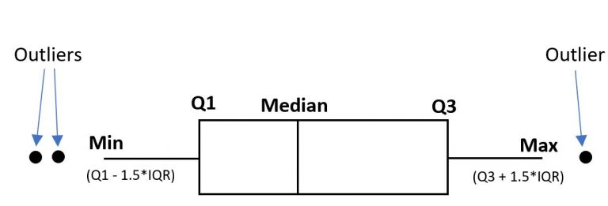

quartiles
=========



## Globally

From the Command Line

```
$ quartiles "{15,7,9,6,1,8,2,9,12,1,-12}"
{
  min: -12,
  Q1: 1,
  M: 7,
  Q3: 9,
  max: 15,
  range: 27,
  interquartileRange: 8,
  outliers: [ -12 ]
}
```

### Installation

```
npm install --global https://github.com/dotnetCarpenter/quartiles.git
```

_or_

## In your project

In code

```js
import { quartiles, median } from "quartiles"

const list = [15,7,9,6,1,8,2,9,12,1,-12]

const { M, Q1, Q3 } = quartiles(list)
const quartileSet = [Q1, M, Q3] // (7 ; 1 ; 9)

const { min, max } = quartiles(list)
const expandedQuartileSet = [min, Q1, M, Q3, max]

const m = median (list)
m  // 7
```

### Installation

```
npm install https://github.com/dotnetCarpenter/quartiles.git
```
